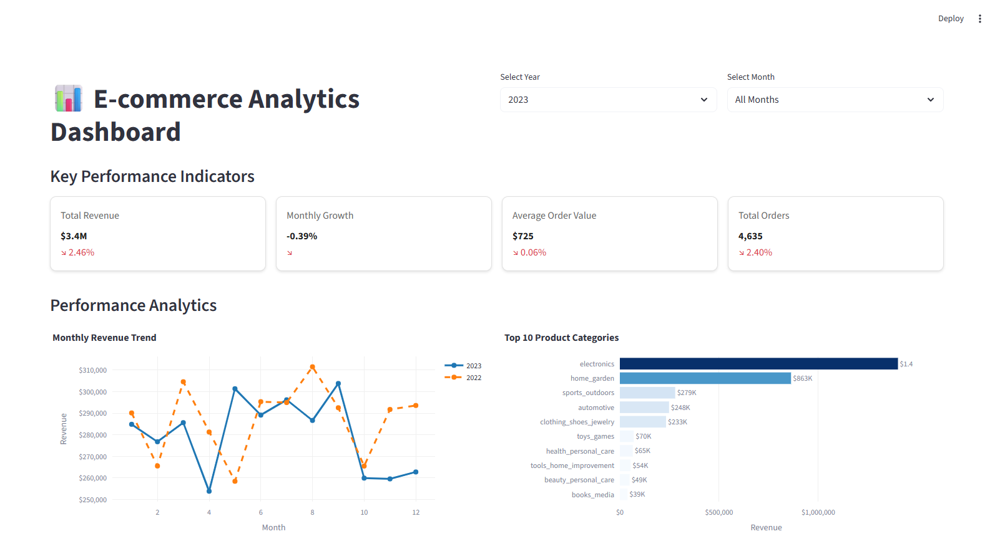

# Technical Project 01 — E-commerce Analytics Dashboard

**Stack:** Python · Pandas · Jupyter · Streamlit · Plotly
**Skill demonstrated:** Notebook → reusable modules → interactive UI

---

## What This Is

A raw exploratory-data-analysis notebook, refactored into a modular Python codebase, and shipped as an interactive Streamlit dashboard — the full arc from "data in a notebook" to "tool someone else can actually use."

| Stage | File(s) | What it shows |
|-------|---------|----------------|
| 1. Explore | [`EDA.ipynb`](EDA.ipynb) | Original exploratory analysis — ad hoc, linear, notebook-only |
| 2. Refactor | [`EDA_Refactored.ipynb`](EDA_Refactored.ipynb) | Same analysis, parameterized and rebuilt on top of reusable modules |
| 3. Extract | [`data_loader.py`](data_loader.py) · [`business_metrics.py`](business_metrics.py) | Data loading and metric calculations pulled out of the notebook into testable, importable modules |
| 4. Ship | [`ecom-dashboard.py`](ecom-dashboard.py) | The same modules powering a live Streamlit dashboard — no notebook required to use it |

## Screenshot



## What It Does

Analyzes an e-commerce order dataset (customers, orders, order items, products, payments, reviews) and surfaces:

- Revenue totals, month-over-month growth, average order value
- Top product categories by revenue
- Revenue by state (geographic breakdown)
- Customer satisfaction vs. delivery time
- Year/month filtering, live in the dashboard

## Running It

```bash
pip install -r requirements.txt

# Interactive dashboard
streamlit run ecom-dashboard.py

# Or open the notebook
jupyter notebook EDA_Refactored.ipynb
```

Data lives in `ecommerce_data/` and is already included — nothing to download separately.

## Attribution

Originally built as the Lesson 7 exercise in DeepLearning.AI's short course *"Claude Code: A Highly Agentic Coding Assistant"* (built in partnership with Anthropic). The starter data and exercise scaffold are the course's; this copy is preserved here as a record of completed, working output and a base to keep extending — the natural next step is deploying the dashboard live and adding new metrics.

---

→ [See all technical projects](../README.md)
→ [Book a discovery call](https://tinyurl.com/maxxam-call)
