# Workflow Library

**43 n8n workflows built across client engagements and internal operations.** This library publishes two tiers publicly. Full implementations are delivered to MAXXAM AI clients only.

---

## Tier Structure

| Tier | What's Shared | Access | Purpose |
|------|--------------|--------|---------|
| `free/` | Functional templates, ready to import | Public | Real utility — import, configure, run |
| `showcase/` | Full architecture with Code nodes redacted | Public | Proof of depth — study the flow, not the logic |
| Client implementations | Complete production workflows | Clients only | Delivered on engagement |

**The IP is not which nodes you connect.** The IP is what's inside the Code nodes — scoring algorithms, routing thresholds, prompt engineering, and error-handling logic learned from production failures. Showcase files show the full architecture with those blocks protected.

---

## `free/` — Import-Ready Templates

Functional workflows with placeholder credentials. Configure and run immediately.

| File | What It Does | Stack |
|------|-------------|-------|
| [WF-1.1-Smart-Waitlist-System.json](free/WF-1.1-Smart-Waitlist-System.json) | Automated waitlist management — polls for open slots, notifies waitlisted clients by SMS | Cal.com · Twilio · Google Sheets |
| [maxxam-linkedin-poster.json](free/maxxam-linkedin-poster.json) | Reads content calendar sheet → posts to LinkedIn via OAuth2 | Google Sheets · LinkedIn API |
| [maxxam-sheet-writer.json](free/maxxam-sheet-writer.json) | Webhook → writes structured records to Google Sheets content calendar | Google Sheets |
| [airbnb-padsplit-market-analyzer.json](free/airbnb-padsplit-market-analyzer.json) | PadSplit co-living market analyzer — evaluates properties against the 75/55 occupancy rule | n8n native nodes |
| [padsplit-75-55-rule.json](free/padsplit-75-55-rule.json) | PadSplit 75/55 rule calculator — companion to the market analyzer | n8n native nodes |

**Setup pattern for all free templates:**
1. Import the JSON into your n8n instance
2. Find the **Config** or **Set Variables** node at the top of the workflow
3. Replace all `{{ PLACEHOLDER }}` values with your own credentials/IDs
4. Connect your credentials in each integration node
5. Test with the Manual Trigger before activating

---

## `showcase/` — Architecture References

Code nodes are redacted. Import into n8n to see the full visual graph — all nodes, all connections, all sticky note documentation. Study the flow; the implementation stays protected.

### Healthcare
| File | What It Demonstrates | Key Nodes |
|------|---------------------|-----------|
| [Healthcare-Appointment-Followup-SHOWCASE.json](showcase/healthcare/Healthcare-Appointment-Followup-SHOWCASE.json) | Appointment event routing — new booking / cancellation / no-show handling | Webhook · Switch · Gmail · Twilio · Sheets |
| [MAXXAM-AI-Quiz-Funnel-SHOWCASE.json](showcase/healthcare/MAXXAM-AI-Quiz-Funnel-SHOWCASE.json) | Lead scoring funnel — quiz submission → tier routing → tiered email sequences | Webhook · Code · Switch · Gmail · Sheets |

### Operations
| File | What It Demonstrates | Key Nodes |
|------|---------------------|-----------|
| [PE-01-Central-Activity-Logger-SHOWCASE.json](showcase/operations/PE-01-Central-Activity-Logger-SHOWCASE.json) | Central activity hub — normalizes events from all automation sources into one log | Webhook · Code · Sheets |
| [maxxam-content-performance-report-SHOWCASE.json](showcase/operations/maxxam-content-performance-report-SHOWCASE.json) | Weekly analytics pipeline — reads content calendar, calculates engagement deltas, emails report | Sheets · Code · Gmail |
| [CEO-Weekly-Dashboard-SHOWCASE.json](showcase/operations/CEO-Weekly-Dashboard-SHOWCASE.json) | CEO operations dashboard — parallel data pulls across all segments → KPI scoring → email + Slack digest | Schedule · Sheets · Code · Gmail · Slack |

### Content & Marketing
| File | What It Demonstrates | Key Nodes |
|------|---------------------|-----------|
| [maxxam-content-generator-SHOWCASE.json](showcase/content/maxxam-content-generator-SHOWCASE.json) | Topic → LinkedIn draft pipeline with quality scoring | Code · HTTP · Sheets |
| [maxxam-newsletter-hub-SHOWCASE.json](showcase/content/maxxam-newsletter-hub-SHOWCASE.json) | Newsletter publication hub with subscriber tier routing | Webhook · Code · Gmail · Sheets |
| [maxxam-newsletter-signup-SHOWCASE.json](showcase/content/maxxam-newsletter-signup-SHOWCASE.json) | Webhook → subscriber deduplication → list sync | Webhook · Code · Sheets |
| [maxxam-reddit-scraper-SHOWCASE.json](showcase/content/maxxam-reddit-scraper-SHOWCASE.json) | 7 subreddits × 30+ keywords → scored lead posts to Sheets | HTTP · Code · Sheets |
| [telegram-image-poster-SHOWCASE.json](showcase/content/telegram-image-poster-SHOWCASE.json) | Telegram prompt → Flux AI image → LinkedIn + Facebook + Instagram | Telegram · HTTP · Code |

### Sales & Outreach
| File | What It Demonstrates | Key Nodes |
|------|---------------------|-----------|
| [MAXXAM-Prospect-Outreach-SHOWCASE.json](showcase/sales-outreach/MAXXAM-Prospect-Outreach-SHOWCASE.json) | 5-email cold outreach sequence with personalization and smart delays | Webhook · Code · Gmail |
| [MAXXAM-Voice-Outreach-SHOWCASE.json](showcase/sales-outreach/MAXXAM-Voice-Outreach-SHOWCASE.json) | Prospect list → AI voice outbound calls → transcript logging | HTTP · Code · Sheets |
| [sales-automation-SHOWCASE.json](showcase/sales-outreach/sales-automation-SHOWCASE.json) | AI lead management + web scraping → GoHighLevel CRM routing | HTTP · Code · CRM |

### AI Agent Orchestration
| File | What It Demonstrates | Key Nodes |
|------|---------------------|-----------|
| [my-ai-army-SHOWCASE.json](showcase/ai-agent/my-ai-army-SHOWCASE.json) | Master AI business automation hub — central orchestration dashboard | Multiple triggers · HTTP · Sheets |

### Real Estate
| File | What It Demonstrates | Key Nodes |
|------|---------------------|-----------|
| [airbnb-burnout-detector-SHOWCASE.json](showcase/real-estate/airbnb-burnout-detector-SHOWCASE.json) | Airbnb host burnout assessment — chat interface with ML-style risk scoring | Webhook · Code · Switch |

### Nonprofit
| File | What It Demonstrates | Key Nodes |
|------|---------------------|-----------|
| [Grant-Pipeline-SHOWCASE.json](showcase/nonprofit/Grant-Pipeline-SHOWCASE.json) | Grant pipeline automation — funder alignment scoring (6 dimensions) → 3-path routing → narrative brief generation → deadline tracking + Slack alerts | Webhook · Code · Switch · Gmail · Sheets · Slack |

---

## Workflow Previews

Live canvas screenshots from the production n8n instance. Architecture shown — Code node logic protected.

<table>
<tr>
<td align="center" width="33%">
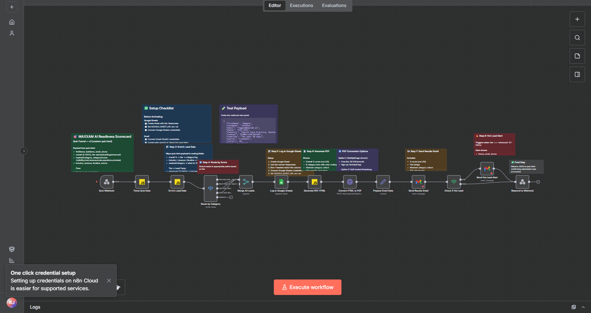 
<b>Lead Scoring Funnel</b> Quiz → tier routing → email sequences
</td>
<td align="center" width="33%">
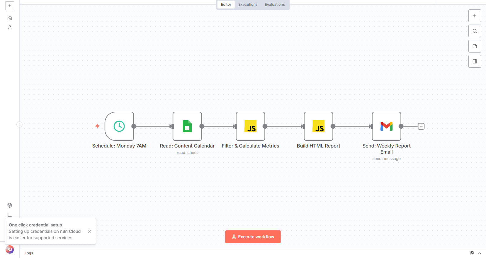 
<b>Analytics Pipeline</b> Sheets → metrics → weekly email report
</td>
<td align="center" width="33%">
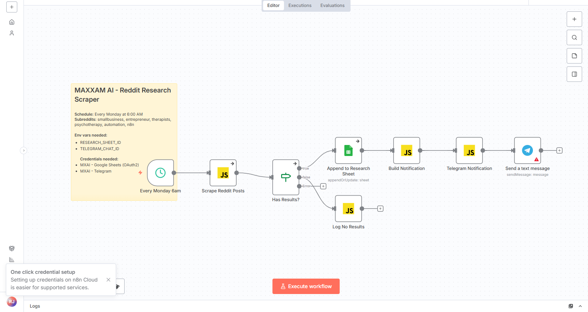 
<b>Lead Intelligence</b> 7 subreddits × 30+ keywords → scored leads
</td>
</tr>
<tr>
<td align="center" width="33%">
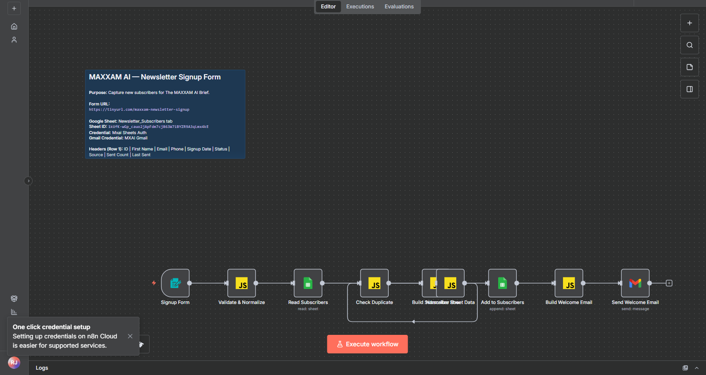 
<b>Subscriber Intake</b> Webhook → dedup → list sync
</td>
<td align="center" width="33%">
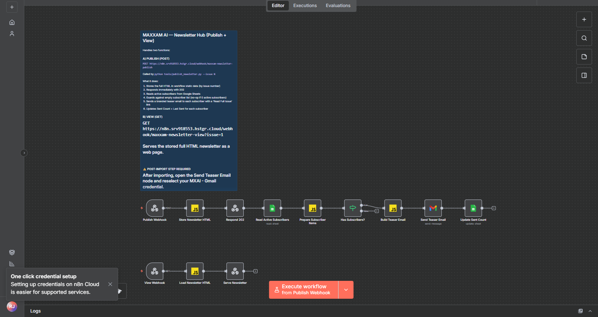 
<b>Publication Hub</b> Subscriber tier routing → send sequences
</td>
<td align="center" width="33%">
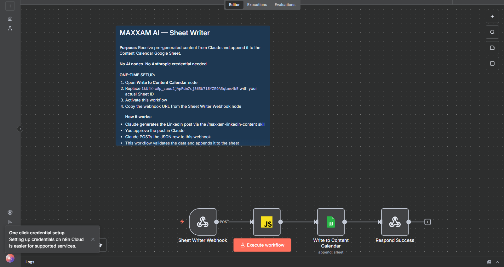 
<b>Content Calendar Sync</b> Webhook → structured rows → Google Sheets
</td>
</tr>
<tr>
<td align="center" width="33%">
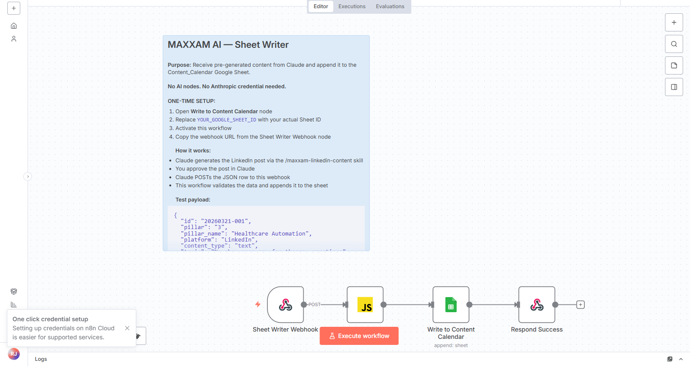 
<b>Social Publishing</b> Content calendar → LinkedIn post via OAuth2
</td>
<td align="center" width="33%">
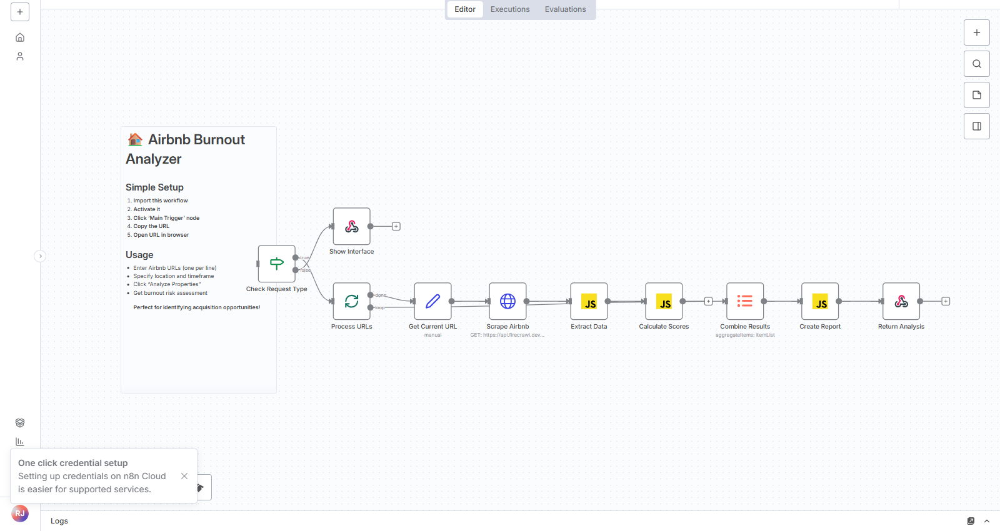 
<b>Risk Scoring</b> Chat interface → ML-style burnout assessment
</td>
<td align="center" width="33%">
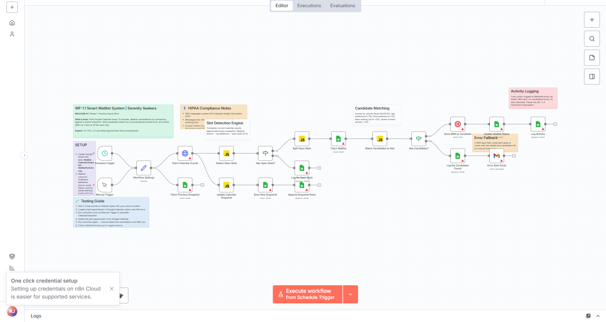 
<b>Waitlist System</b> Cal.com → slot polling → SMS notification
</td>
</tr>
<tr>
<td align="center" width="33%">
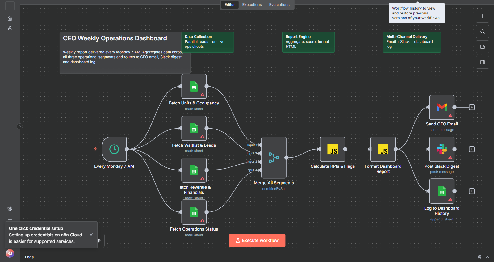 
<b>CEO Operations Dashboard</b> 4 data sources → KPI scoring → email + Slack digest
</td>
<td align="center" width="33%">
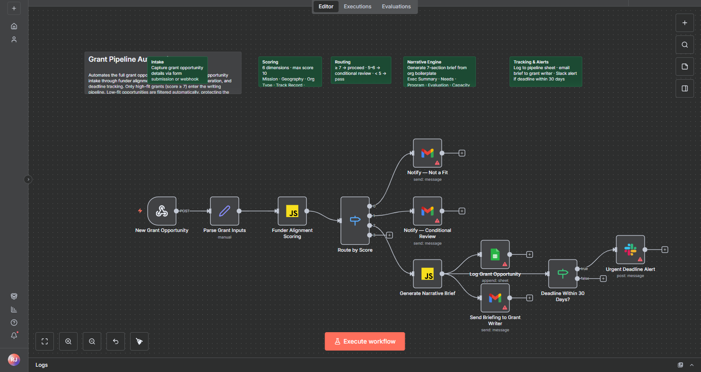 
<b>Grant Pipeline Automation</b> Funder scoring → 3-path routing → narrative brief → deadline alerts
</td>
<td width="33%"></td>
</tr>
</table>

---

## Want the Full Implementations?

Full workflows — with production Code node logic, AI prompts, error handling, and multi-workflow orchestration — are delivered to MAXXAM AI clients as part of an engagement.

→ **[Book a Discovery Call](https://tinyurl.com/maxxam-call)**  
→ **[Take the AI Readiness Quiz](https://www.maxxam.ai/quiz.html)**  
→ **[Read the Case Studies](https://www.maxxam.ai/case-studies.html)**

---

*All workflows built with n8n v1.x. Import showcase files in a staging environment — they load visually but Code nodes return empty stubs and will not execute production logic.*
